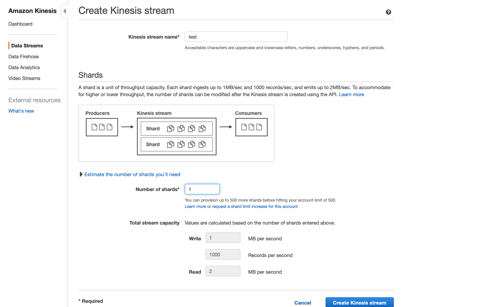

---
title: AWS Kinesis
slug: /aws-kinesis-connector
--- 

Amazon Web Services Kinesis

AWS Kinesis data connector configuration object consists of the following attributes:

|Attribute|	Description|
| :-------------: |:-------------:| 
|type	|Connector type; must be always set to aws-kinesis.|
|id|	App wide unique connector id.|
|credentials|	Username and password to connect to the service.|
|region|	Region name of the AWS Kinesis Service. See below for valid regions.|
|stream|	Stream name.|
|shards|	Number of shards specified when creating the stream.|
|maxRecordsPerShardPerSecond	|Max records per shard per second.|
|maxBytesPerShardPerSecond|	Max bytes per shard per second.|
|dataProcessingMethodId|	**Optional.** Id of the App method that will be used for filtering and/or transforming incoming data. See Overview page for details.|
|disabled|	**Optional.** When true data connector stops streaming.|

### Valid Regions

```
GovCloud("us-gov-west-1", "AWS GovCloud (US)"),
US_GOV_EAST_1("us-gov-east-1", "AWS GovCloud (US-East)"),
US_EAST_1("us-east-1", "US East (N. Virginia)"),
US_EAST_2("us-east-2", "US East (Ohio)"),
US_WEST_1("us-west-1", "US West (N. California)"),
US_WEST_2("us-west-2", "US West (Oregon)"),
EU_WEST_1("eu-west-1", "EU (Ireland)"),
EU_WEST_2("eu-west-2", "EU (London)"),
EU_WEST_3("eu-west-3", "EU (Paris)"),
EU_CENTRAL_1("eu-central-1", "EU (Frankfurt)"),
EU_NORTH_1("eu-north-1", "EU (Stockholm)"),
AP_SOUTH_1("ap-south-1", "Asia Pacific (Mumbai)"),
AP_SOUTHEAST_1("ap-southeast-1", "Asia Pacific (Singapore)"),
AP_SOUTHEAST_2("ap-southeast-2", "Asia Pacific (Sydney)"),
AP_NORTHEAST_1("ap-northeast-1", "Asia Pacific (Tokyo)"),
AP_NORTHEAST_2("ap-northeast-2", "Asia Pacific (Seoul)"),
SA_EAST_1("sa-east-1", "South America (Sao Paulo)"),
CN_NORTH_1("cn-north-1", "China (Beijing)"),
CN_NORTHWEST_1("cn-northwest-1", "China (Ningxia)"),
CA_CENTRAL_1("ca-central-1", "Canada (Central)");
```

**Create:**
```
POST .../v3/apps/:ref/dataconnectors

{
  "type": "aws-kinesis",
  "id": "dc.kinesis.1",
  "credentials": {
    "user": "AKIAJH44BQER4BMM6Q",
    "password": "mypassword"
   },
   "region": "us-west-2",
   "stream": "test",
   "shards": 1,
   "maxRecordsPerShardPerSecond": 1000,
   "maxBytesPerShardPerSecond": 1000000,   
   "disabled": false
 }
 ```

**Update**
```
PUT .../v3/apps/:ref/dataconnectors/dc.kinesis.1

{
   "shards": 2,
   "maxRecordsPerShardPerSecond": 1000,
   "maxBytesPerShardPerSecond": 1000000
 }
```

### AWS Kinesis Service Setup

Kinesis Stream settings on AWS Management Console.



