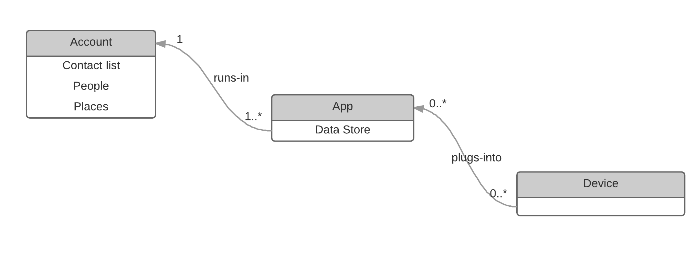

Context plays an important role when developing IIoT solutions with csip.io. There are 3 main contexts in csip.io: **account, app and device**. As shown above, each app runs within account context; each device might operate within app context. Sometimes we describe the relationship between account and app as "app A is deployed into account B" or "app A runs in account B"; the relationship between app and device as "device D is plugged into app A".

Each context has its own variables that are shared with entities running within this context. Apps can automatically access to account context variables, similarly, devices can access both to app and account context variables. This feature allows you to architecture your solution as generic as possible. For example, when creating an alert, instead of entering a hard coded list of people to notify, it is possible to define a contact list that takes its content from its execution context (i.e. account context).

In csip.io, some sub resources are context-sensitive. That means that these sub resources might be override by the context they are in.