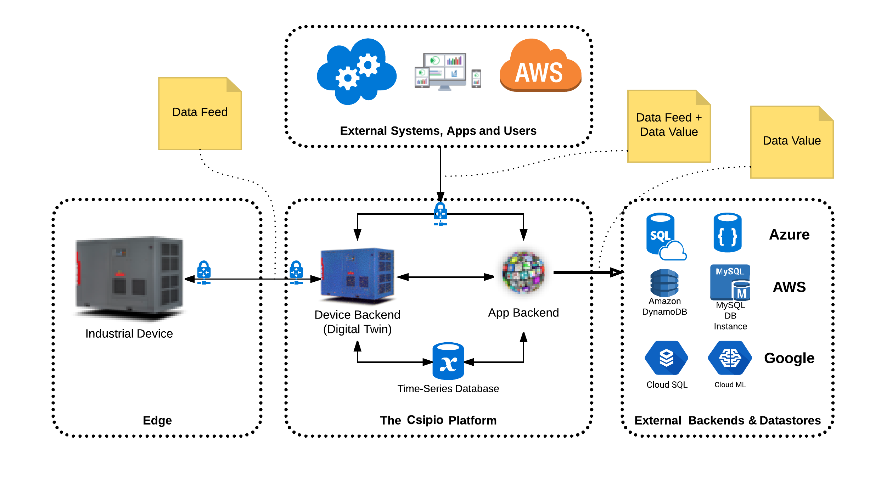

Csip.io clients can read/write data from/to the platform using the Data Services API. A `Property` represents a sub resource under `Device` and `App` entities to store data. Atomic read/write operations should be run against properties.

Each property has a retention policy that can be set by the user. If set to `historical`, the Csip.io platform stores every value written into this property in the system time-series database for the duration defined by the retention policy. If set to `mostrecent`, only the most recent data written into this property can be queried. See Properties and Reading Data for details.

For example, in order to capture time-series data from a temperature sensor, it would be sufficient to create a number type property with retention policy `historical`. We usually call a data value written into a property a data point because of its temporal nature. In Connio, it is also possible to associate any data point with a geo-coordinate (or capture location).

> ### 📘 Data Lifecycle and Ownership
> Although data points stored in the system time-series database might contain references to their data sources, no ownership relationship is established automatically between them. Removing a data source do not cause its data points to be removed from the database. This requires careful management; beware of possibility of having orphan data points in your database.

All data interaction with the Connio platform evolves around 3 types of data objects. These objects are:

| Type |	When |	Description |
| :-------------: |:-------------:|:-------------:|
| [Data Feed](https://www.google.com)|	Data in transit	 | Encapsulated multiple incoming data points.|
|[Data Point](https://www.google.com)	 | Data in transit |	Single unit of temporal data.|
|[Data Value](https://www.google.com)	| Data at rest |	Enriched version of data point.|