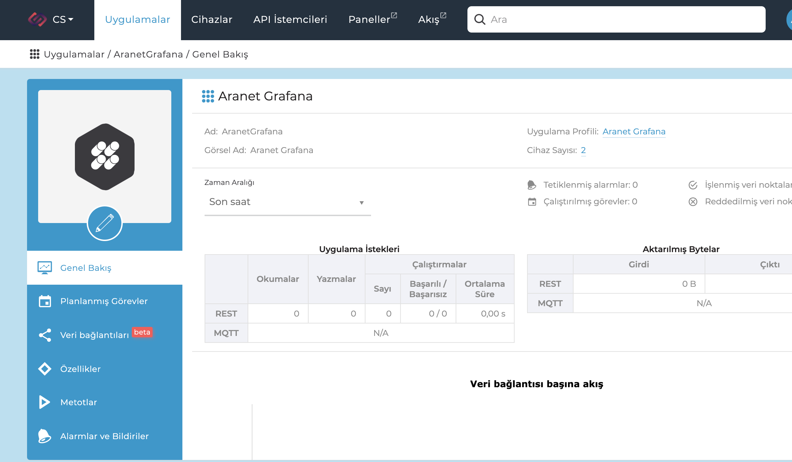
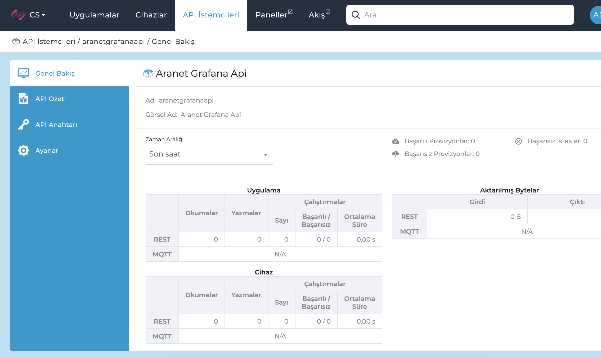
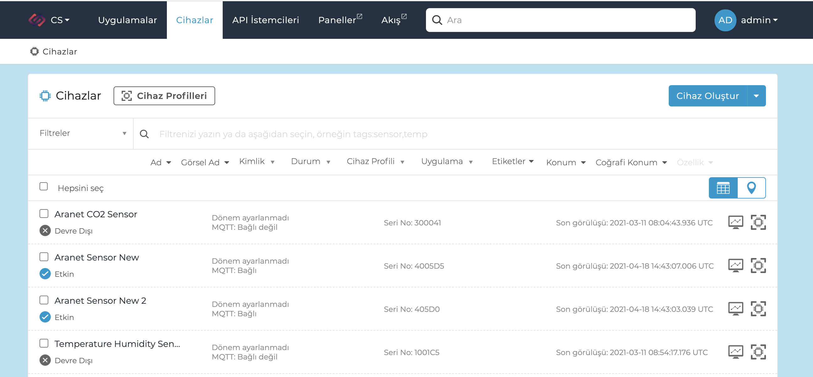
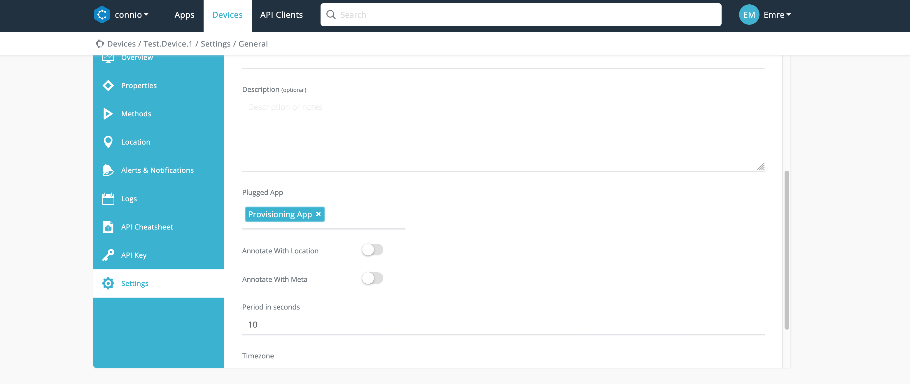
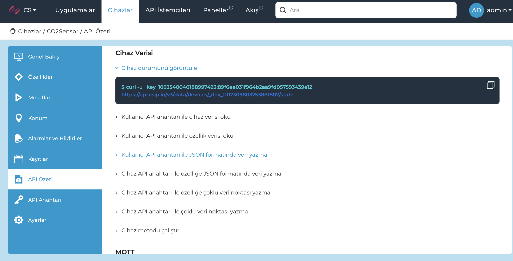
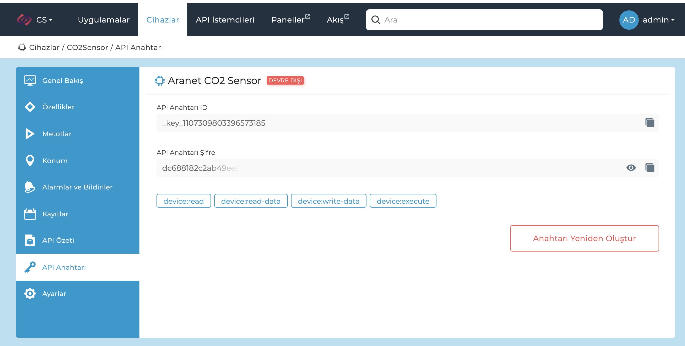

This sample python code can be used freely in any device to bidirectionally communicate with the Csip.io platform.

## Background

The following example shows how you can connect a device to the platform using  
[provisioning](https://developer.csip.io) mechanism or directly using device credentials.

### Step by Step Instructions

In order to use the provisioning mechanism, you need to do the following:

#### 1. Create an App



#### 2. Create an API Client

Create an API Client with App context, and device:read scope to access to the provisioning app



#### 3. Create a custom identifier for your device



#### 4. Link your device to your App

Final step is to link your device to the app that will be used for provisioning purpose.



### Access Credentials

In order to use the code, you need to set the following environment variables with your accounts values:

#### Host

```
BROKER_HOST
BROKER_PORT
```

> ### ❗️ SECURITY WARNING
> Always use port 8883 in production.

#### Option 1: Access using device credentials

````
CSIPIO_DEVICE_ID
CSIPIO_DEVICE_KEY_ID
CSIPIO_DEVICE_KEY_SECRET
````

You can easily access this information on Csipio Portal.



<center> Device Cheatsheet Page </center>


#### Option 2: Access using provisioning mechanism

````
CSIPIO_PROVISION_KEY_ID
CSIPIO_PROVISION_KEY_SECRET
CSIPIO_DEVICE_SN
````


You can check provisioning key details at API Key Credentials page.