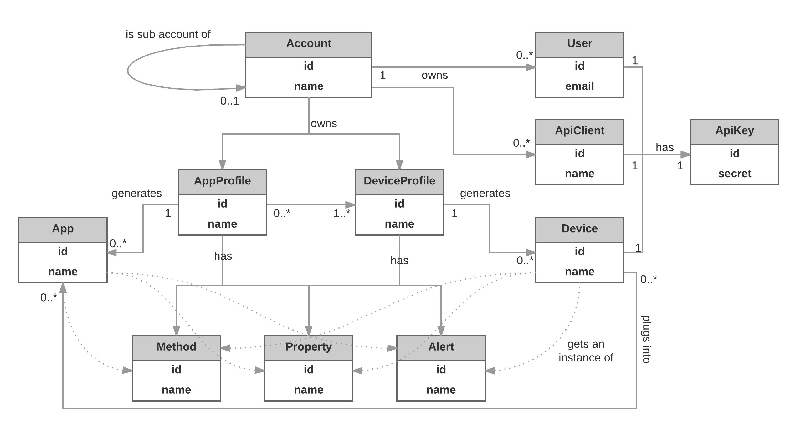

This section explains the entities make up the Csip.io domain model. Each entity is represented as a resource by Csip.io API.

## Account

Account entity represents a single csip.io system account. A system account can be `master` or `sub` depending on its place in the hierarchy.

When you first signup with csip.io, the system automatically creates a master account for you with a system wide unique identifier. Depending on your account type, each master account can contain multiple device profiles, devices, apps, users and sub accounts.

Sub accounts may belong to master accounts or other sub accounts. Admin users or other users with proper privileges can creates sub accounts; we refer to the creator account as **“owner account”**. It is possible to create a sub account hierarchy up to three levels deep.

All users of the owner account automatically get some privileges over their sub accounts unless they are explicitly limited by their admin. They can list and manage (i.e. create, delete, update) all the entities belonging to their direct sub accounts. For example, a user can list all the devices that belong to its sub accounts, but not the devices of the sub account one level below in the hierarchy.

An owner account can mark its device and app profiles as shared. When shared, selected profiles are automatically cloned into its sub accounts' context in locked mode. All sub accounts in all levels get a copy of their own. Sub account users cannot modify "shared" profiles but they can create devices or apps from them.

If owner account's profile is updated, this change is not automatically reflected to its sub accounts' shared profiles. Sub accounts should explicitly request an update for the changes to take place.

## User

Once a master account is created, an admin user is also created along with the account. This user claims the ownership of the master account and, as its name suggested, seizes administrator privileges. He/She can create, and manage other account users, api clients, devices, apps, and other account entities. Each master account needs at least one admin user and the privileges of this user cannot be revoked or changed by other users, although it can be disabled or deleted by other admins.

Admin user can invite more users to the system with different predefined roles. Based on their roles and privileges each user is allowed to do certain operations within the context of their account.

System users are personas who interact with the platform in order to develop an IIoT solution or monitor the system. System users should not be confused with users typically defined by your solution's domain.

All external users (or clients as we call them) need to interact with the csip.io platform should be provided with an API Key for authentication and authorization purposes.

## API Client

API Clients are external users, agents, and systems that interact with the csip.io platform through csip.io API. Each client can be introduced to the csip.io platform by creating an API Client entity.

Each API Client comes with its own API Key (a.k.a API Client Key) with configurable security context and scope to define the access level and privileges of the API Client. API Client and API Client Key relation is exact 1 to 1 composition.

API Client Key can be regenerated if comprised, or its privileges can be revoked anytime by account admins.

## API Key

API Keys are required to communicating with the csip.io platform. They represent an API Key Id and Secret pair which is generated for a device, or a external system/client (e.g. API Client) reading/writing data from/to the platform, or managing the system entities such as accounts, devices, etc.

System entities acting like data producers or consumers such as device, api client, or user entities get an API Key automatically by the system when they are created. API Key Id and secret can be changed by the account admin later if compromised.

The csip.io system automatically tracks the usage of each API Key for both light weight calls such as `GET, DELETE, HEAD ` and heavy weight calls such as PUT and POST.

## App Profile

A vertical application is a solution involving devices (i.e. data sources), data, business rules, processing, and analyzing capabilities. Although it is possible to develop simple solutions with csip.io using traditional device centric approach where your vertical application lives on an external system (e.g. Heroku), starting with version 3, csip.io provides you with an alternative application centric approach to develop much more complex Industrial Internet of Things solutions, fast, and more integrated.

App Profile conceptually corresponds to a vertical solution, and acts like a template from which instances of vertical Industrial IoT applications (apps in short) are created.

## App

App is an instance of a vertical application (i.e. App Profile) that is deployed into a specific account. It creates a context where all elements of the vertical application (i.e. devices, data, logic (i.e. methods), etc..) to work in concert in order to achieve a business goal.

An app can have its own properties and methods like devices however unlike devices it can also consume data from other data sources such as devices plugged into this app, and web services.

For example, if you develop a smart home solution with csip.io, you can create an App Profile with all device profiles and general logic involving within this solution, then create a sub account for each customer you might have, and deploy an App generated from this App Profile into these sub accounts. Each customer sub account and app allow you to modify the context of your solutions and manage your customers account in ease through the csip.io platform.

## Device Profile

A Device Profile (also called as Device Type) is akin to a template from which device backends are created. It captures the common characteristics of physical devices. This mechanism is essential to create digital twins of your physical assets.

Device profile is analogous to class concept in object-oriented programming. Properties define its states, and methods define its behaviours. Each device created from a device profile gets an instance of its properties and methods.

For example, if you are developing a solution using a device with single temperature and single humidity sensor, the first thing you should do is to create a profile for this device to define all its properties (two in this case) and methods. Then you can create any number of device instances from this profile to complete your solution.

Object-oriented programming allows classes to inherit commonly used state and behaviour from other classes. Similarly, in csip.io each device profile is allowed to have one direct superclass (base device profile), and each superclass has the potential for an unlimited number of subclasses.

Physical or not, any data source interacting with csip.io can be modelled after a device profile.

## Device

Device entity or a device backend represents any physical data source (or producer) that has capability to write data to or receive commands from the csip.io platform. It can be a sensor, gateway, wearable device, or another external system.

An API Key is automatically generated and assigned to each device during creation. The combination of the key id and secret is used by the device to authenticate itself and write/read data to/from the csip.io platform. This special purpose key is also called as Device Key.

Devices might or might not be associated with apps (plugged into apps). A device can be plugged into up to 10 apps. Once plugged, they become accessible from the apps and their API keys.

Note that we use the terms device backend and device interchangeably throughout this document.

## Property

A property is a metric being tracked of some data source. Properties can be bi-directional and represents the individual time-series from/to data sources. Each property defines a data type, retention policy and optionally boundaries to govern the incoming and outgoing data. As a csip.io convention, all readings expected from devices or other data sources are modelled as properties (e.g. temperature, humidity, engine status, etc...)

csip.io provides a built-in, high efficient time-series database and query API. When a property's retention policy is set to historical, data captured by this property is automatically stored in this database.

Property entity is created as a sub resource of a device and app profiles. All devices and apps that are generated from such profile automatically get an instance of its properties.

Please note that when we say property we refer to the property definition created within a profile entity. When we say property instance, we refer to the instance of this property created per object.

## Method

Methods can be used to transform and process the incoming data, or send commands to the device they belongs to. Usually they take a property as input, write the result into another property. public methods can be called from external systems with proper API keys.

Method entity is created as a sub resource of device and app profile. All devices and apps that are generated from such profile automatically get an instance of its methods.

## Alert

Collecting metrics about our Industrial IoT systems is very important; monitoring them and alerting when anomalies arise is as important. This is where csip.io really shines.

csip.io comes with very comprehensive device level alerting mechanism. You can use alerting mechanism to notify involving parties or execute actions when anomalies arise in your solutions.

Alert entity holds an alert definition including conditions and actions. Alerts can be created under device profile to be shared by all the devices created from this device profile, or under a device to be used solely by this device. Actions can be chained or can run in parallel.

Please note that an Alert is not a part of the profile's object model hence they cannot be inherited when generating child device or app profiles.