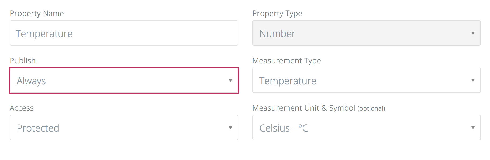

Device mirroring gives you real-time read-only access to all device properties that have their `publish` attribute set to `always` or `changed`.



`<account-name>/apps/<app-name>/devices/<device-name>/properties/<property-name>`

Alternatively, clients can subscribe to a single device mirror topic in order to listen to data generated from all devices that are plugged into the app in question:

`<account-name>/apps/<app-name>/devices/#`

An API client key with `Application` context and `device:read-data` scope is required to connect to the Csip.io broker in order to subscribe to a device mirror topic as shown below:

Creating an api client for listening incoming device data:

````
POST https://api.csipio.com/v3/apiclients

{
  "name": "Data-Subscriber",
  "description": "An api client to listen incoming data of devices plugged into the default app via Connio MQTT broker.",
  "context": { 
    "type": "app",
    "ids": ["_app_918165076511726851"]
  },
  "scope": ["device:read-data"]
}
````

In such scenario, the user should connect the broker using this API Client credentials (i.e. API Client id as MQTT Client id, key id as username and secret as password), and subscribe to the device mirror topic as shown below.

> ### ❗️ IMPORTANT
> Device mirror topic path names must be lower-case.

See API Cheatsheet section of the device to get the actual device mirroring address.