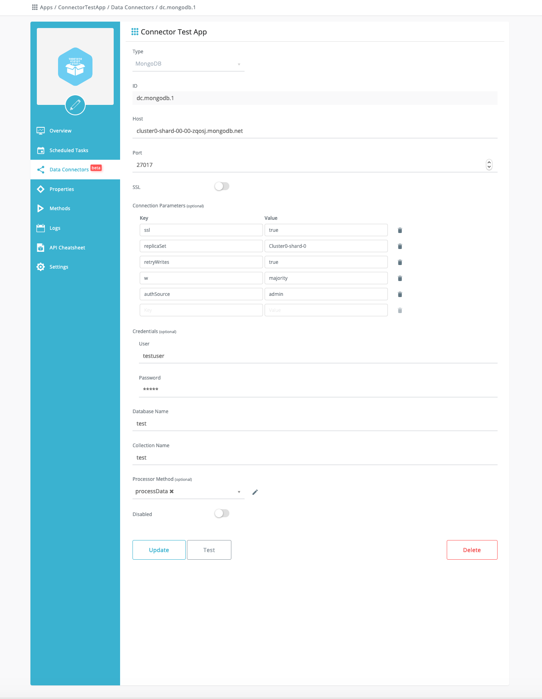

MongoDB data connector configuration object consists of the following attributes:

|Attribute|	Description|
| :-------------: |:-------------:| 
|type|	Connector type; must be always set to mongodb.|
|id|	App wide unique connector id.|
|server	|Provide only the domain part of the URL without scheme.|
|port|	Service port number.|
|connectionParameters|	**Optional** Map of connection parameters - up to 10.|
|credentials|	**Optional** Username and password to connect to the broker.|
|database|	Database name.|
|collection	|Collection name.|
|dataProcessingMethod|	**Optional.** Id or name of the App method that will be used for filtering and/or transforming incoming data. See Overview page for details.|
|disabled|	**Optional.** When true data connector stops streaming.|

**Create**:
```
POST .../v3/apps/:ref/dataconnectors

{
  "type": "mongodb",
  "id": "dc.mongodb.1",
  "server": "cluster0-zqosj.mongodb.net",
  "port": 80,
  "credentials": {
    "user": "testuser",
    "password": "testuser"
  },
  "database": "test",
  "collection": "test",
  "connectionParameters": {
    "ssl": "true",
    "replicaSet": "Cluster0-shard-0",
    "retryWrites": "true",
    "w": "majority",
    "authSource": "admin"
  },
  "disabled": false
}
```

**Update**
```
PUT .../v3/apps/:ref/dataconnectors/dc.mongodb.1

{
  "database": "test2",
  "collection": "test2"
}
```


