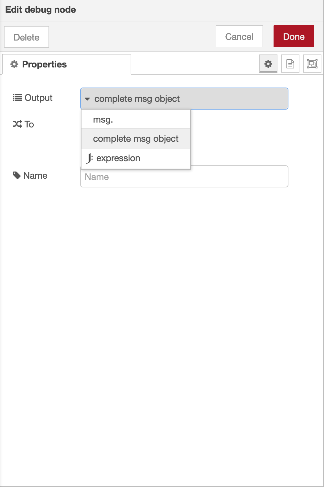

Node-RED is a programming tool for wiring together hardware devices, APIs and online services in new and interesting ways. You can integrate your Connio account with Node-RED using our `node-red-contrib-connio` package. You can download and start using this package from Node-RED's Manage Palette menu.

If you use Node-RED's default debug node as shown above, make sure that `Output` field is set to `complete msg object` to see incoming data.

