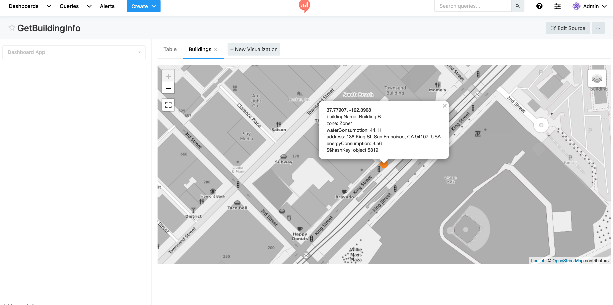

Redash is a popular open-source tool to build dashboards and visualize data. Csipio provides seamless integration of your IoT data with Redash.

Below are step-by-step instructions for creating a dashboard in Redash to view information about buildings managed in your Csipio account.

1. Create an App under your account called `Dashboards` (or another name of your choice)

2. Assume that we have a couple of buildings modelled as devices in the Csipio platform and want to connect them to Dashboards app to stream building data into the app . For example, we may want to display summary information about each building as shown below:

**Sample response from getBuildingView()**:
```
{
  "buildingName": "Building B",
  "address": "138 King St, San Francisco, CA 94107, USA",
  "lat": 37.779070,
  "lon": -122.390800,
  "zone": "Zone1",
  "waterConsumption": 44.11,
  "energyConsumption": 3.56
}
```

We can return such information from a device method called `getBuildingView()`.

3.Create a method with `public` access called `getView()` under our `Dashboards` app.

4.The first requirement is to provide a schema for Redash to format the data as shown below:

```
** getView Implementation Part #1 **

let simpleView = {
      "columns": [
        {
          "name": "buildingName",
          "type": "string",
        },
        {
          "name": "address",
          "type": "string",
        },
        {
           "name": "lat",
           "type": "float",
        },
        {
           "name": "lon",
           "type": "float",
        },
        {
          "name": "zone",
          "type": "string",
        },
        {
          "name": "waterConsumption",
          "type": "float",
        },
        {
          "name": "energyConsumption",
          "type": "float",
        }
      ],
      "rows": [ .... actual data goes here ... ]
     ]   
    };

return result;
```

5. The second requirement is to populate the response object that will be sent to Redash according to the schema provided above.

Below we query all devices (e.g. buildings) connected to our app, and execute their `getBuildingView()` method. Finally we aggregate all data and put into an object to return toRedash.

```
getView() implementation Part #2
const extractResultField = ({ result }) => result;

const collectDeviceData = (d) =>
  App.api.executeDeviceMethod(d, 'getBuildingView', value);

const buildView = async (devices) => {
  const requests = devices.map(collectDeviceData);
  const result = await Promise.all(requests);
  
  return result.map(extractResultField);
};

return App.api
  .findDevices({})
  .then(buildView)
  .then((resultSet) => {
    return resultSet;   
  });
```

6. Below you can find the full implementation of the `getView()` method:

```
getView()
const extractResultField = ({ result }) => result;

const collectDeviceData = (d) =>
  App.api.executeDeviceMethod(d, 'getBuildingView', value);

const buildView = async (devices) => {
  const requests = devices.map(collectDeviceData);
  const result = await Promise.all(requests);

  return result.map(extractResultField);
};

return App.api
  .findDevices({})
  .then(buildView)
  .then((resultSet) => {
    let simpleView = {
      "columns": [
        {
          "name": "buildingName",
          "type": "string",
        },
        {
          "name": "address",
          "type": "string",
        },
        {
           "name": "lat",
           "type": "float",
        },
        {
           "name": "lon",
           "type": "float",
        },
        {
          "name": "zone",
          "type": "string",
        },
        {
          "name": "waterConsumption",
          "type": "float",
        },
        {
          "name": "energyConsumption",
          "type": "float",
        }
      ],
      "rows": resultSet
    };
    return simpleView;
  });
```

7. Next step is to create an API Client to execute the App method from Redash.


Displaying the credentials of the API Client created to be used by Redash


8. Now we need to setup Redash as shown below.

Start by creating a new data source.


Create URL data source.


Provide your App endpoint with API Client key required to call our app methods. Note that only one data source per App is sufficient.

Create a new query by providing our method name `getView`.


Finally, create your dashboard.

