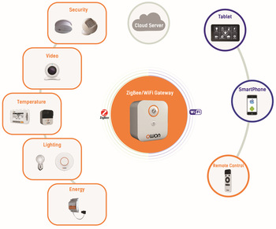

Predefined device profiles come with built-in logic to automate common IoT scenarios you might need when you manage your devices. Like class inheritance in OOP, inherited device profiles carries their capabilities including their alerts with them into their child.

Since predefined profiles consist of properties and not attributes, each property can be used in different alarm scenarios. For example, if you inherit your profile from Device, and create an alert connected to Active property at Device level, your profile does also benefit from this alert automatically. See alerts for details.

> ### 📘 Beware of IS-A relationship
> Similar to OOP, csip.io's device profile inheritance mechanism allows profiles to be arranged in a hierarchy that represents "is-a-type-of" relationships. For example, profile CellularDevice might inherit from profile ConnectedDevice. All the data and methods available to the parent class also appear in the child class with the same names.

## Device

A generic profile to represent any type of bidirectional data source. It helps device developer to monitor data-source/device activity based on communication frequency, and track inbound and outbound traffic.

It consists of the following properties:

| Name	        |  Description	|  Type	| Values
| :-------------: |:-------------:| :-----:| :-----:|
| active	    | This property is set to inactive automatically if the device is not communicating with | the system within the timeframe defined by its period attribute. It is always unknown if period is not set to any positive integer duration (i.e 0). | enum	| active, inactive, unknown.| 
| lastIn        | 	Stores the details of the last write operation completed by the device. The details consist of the name of the last written property and timestamp.	| string |	property name
| lastOut	    |   Stores the details of the last data successfully sent to the device by the platform. The details consist of the name of the property and timestamp.	| string |	property name


## ConnectedDevice

A generic profile to represent any type of connected device. It helps device developer to monitor connectivity of the device. It inherits `Device` device profile.

It consists of the following properties:

| Name | Description |	Type | 	Values |
| :-------------: |:-------------:| :-----:| :-----:|
| connectionInfo	|  Provides additional information about the connectivity of the device such as its remote IP and connected endpoint. It consists of ip and endpoint fields. endpoint can be mqtt or rest.	| object	| 
| connectionStatus | 	If the device is connected to the platform through MQTT, it set automatically to online by the system. Otherwise it is set to offline.	| enum	| online, offline.| 

## Gateway

Some IoT scenarios require a gateway that facilitates the communication between the edge devices and your solution backend, such as smart home systems. Gateway profile helps developers to model their IoT solutions without losing semantics about the configuration of their devices.



### The problem

If you have constant number of sensor types and constant number of sensors per installation, the low hanging fruit approach would be to create a single device profile with multiple properties where each property corresponds to a sensor. As long as your gateway's firmware manages the mapping between the sensors and your profile properties, this approach works securely through a single device key (i.e. your gateway device key).

Unfortunately this approach falls short (1) when you have multiple types of sensors that are installed in variable quantities per zone (e.g. some customers have 2 door sensors, some might have 5, some have none), (2) when you want to keep track your exact device inventory per installation under the platform, and (3) when you want to build reusable device or app logic that goes with your solution.

The right approach would be to create a device profile for each sensor type and a device for each sensor. Each customer/installation can be modelled after a sub account or app on the platform, and can be assigned to their unique system - actual device combination deployed in the field. This way Csipio's device inventory capabilities can be leveraged, and devices will be managed as close as possible to the real topology. Although sounds good, this approach comes with a slight issue. Csipio assigns a unique device key to each device to authenticate and authorize the data exchange. When we create a unique device for each sensor, the platform accepts data only when the proper keys are used. Without the help from the solution backend, the device key management should be done by the gateway's firmware (i.e. mapping each edge device to a device key locally), and makes the firmware code slightly more complex and hard to manage.

### The solution

The term to describe such tightly coupled, location bound device configurations is called device systems under the Csipio platform. Gateway profile can be used to represent EDGE and CLOUD device systems naturally. Note that by saying EDGE device systems we refer to sensor networks consist of a gateway and local area sensors such as Zigbee, Bluetooth, etc, and by saying CLOUD device systems we refer to systems where devices represented on the Csipio platform hosted or managed by other platforms.

Devices generated from Gateway profile are different from other devices. First, they can be associated with other devices. This relationship gives them the power of (1) acting on behalf of these devices using single key (gateway device key) - that solves the key distribution and management issue mentioned earlier; (2) accessing associated devices' methods and properties from their methods (see Method Implementation) - that provides a huge flexibility to the developers.

As we have mentioned, a device generated from the Gateway profile can be associated with other devices by simply adding device ids into the gateway device key id list.

`PUT .../v3/devices/_dev_785862679194761789/apikey`

API Key Object
````
{
  "context": {
    "type": "device",
    "ids": [
      "_dev_785862679194761789", 
      "_dev_200062579194761790", 
      "_dev_085862679194761791"
    ]
  }
}
````

where `_dev_785862679194761789` is your gateway device id (the first id is always belong to the actual device), other ids (i.e. `_dev_200062579194761790` and `_dev_085862679194761791`) are belong to the devices working behind this gateway.

Once done, gateway can read/write data to/from the platform on behalf of these devices using its own device key by simply replacing its device's id with the edge device's id. For example:

`POST .../v3/data/devices/_dev_200062579194761790/properties/temperature`

Note that device key for this request is belong to the gateway.

Data Feed

````
{
  "dps" : [
        { "t": "2017-10-12T00:34:34Z", 
          "v": 0.23
        }
      ]
}
````

Same goes for the MQTT connections. The gateway can publish and subscribe to topics involving their edge devices.

For example, the gateway can publish data using the following topics:

`csipio/data/out/devices/_dev_200062579194761790/properties/json`
`csipio/data/out/devices/_dev_085862679194761791/properties/json`

Also it can subscribe to the following topics to listen data coming from the platform:

`csipio/data/in/devices/_dev_200062579194761790/properties/#`
`csipio/data/in/devices/_dev_085862679194761791/properties/#`

Another goody about gateway behaviour related to MQTT is, gateway shares its connection status info with its edge devices automatically. Meaning that, if a gateway disconnects, all edge devices within the system of this gateway gets a disconnected notification to their connection status property.

You can create your own gateways by inheriting from the default `Gateway` device profile.

