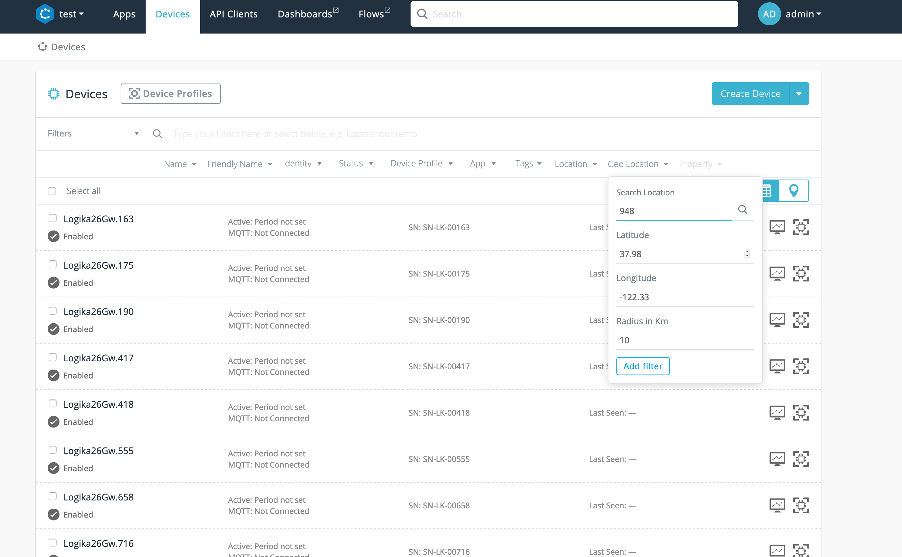
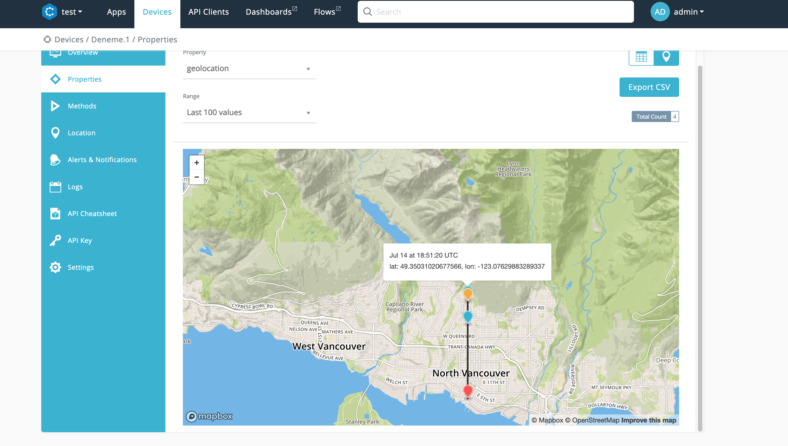
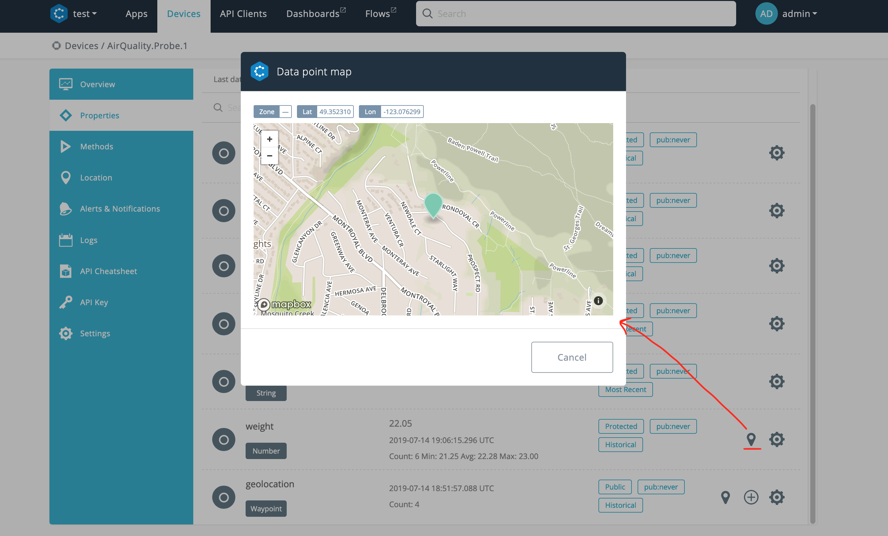
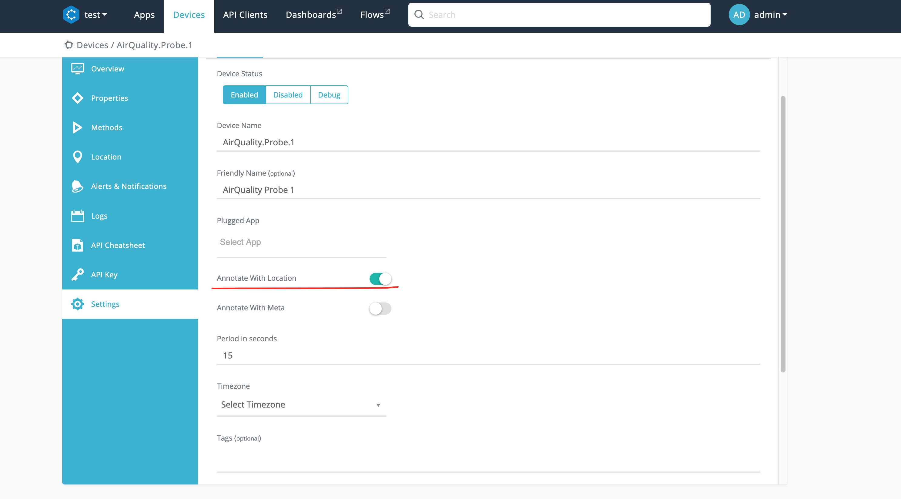

The Connio platform allows you to work with device and data points locations in different IoT scenarios. Below we explain each scenario and which mechanism to use for your project.

### Stationary devices

If your device is stationary (location won't change much) then we suggest you use `location` field of the device entity. This will allow you to filter your device by radius or zone name from Csip.io API and portal.


<center> Filtering devices by location on Csip.io Portal </center>


### Mobile devices

If your device is changing location regularly, you should collect its location in a geo-location aware `waypoint` property type. Connio portal has capability to display the device location on a map if the property type is `waypoint`.



### Capturing and storing location info with data points

Imagine that you are developing a backend for a mobile device that captures pollution readings at specific locations. In such scenario it makes sense to store pollution readings and their locations together. Data Point object is location-aware and it allows you to store geo location information with the reading.

For example, below we write 3 air quality readings with their locations:

````
POST .../v3/data/devices/airquality.probe.1/properties/airquality

{
  "dps": [ 
    { "t": "2019-07-14T00:00:00.000Z", "v": 22.45, "loc": { "geo": { "lat": 49.35031020677566, "lon": -123.07629883289337 } } },
    { "t": "2019-07-14T00:01:00.000Z", "v": 21.25, "loc": { "geo": { "lat": 49.35131020677566, "lon": -123.07629883289337 } } },
    { "t": "2019-07-14T00:02:00.000Z", "v": 22.05, "loc": { "geo": { "lat": 49.35231020677566, "lon": -123.07629883289337 } } }
  ]
}
````

The Csip.io portal will indicate if there is a location associated with the reading as shown below:


<center>Reading with location</center>

### Automatically adding location of stationary devices

We have explained above how you can easily store locations of your readings that you mobile devices captures. In some cases you might want to do the same thing for stationary devices in order to decouple the data point and the device location from each other. Since the stationary device location never changes, the platform provides a server side mechanism to automatically add the device location to each data point captured after they have written to the platform but just before they are persisted. This feature eliminates the need to explicitly send reading location with each data point. This per-device mechanism can be activated by setting device attribute `"annotateWithLoc `to `true` or on the portal you can set as shown below:


<center>Enabling auto location mechanism</center>